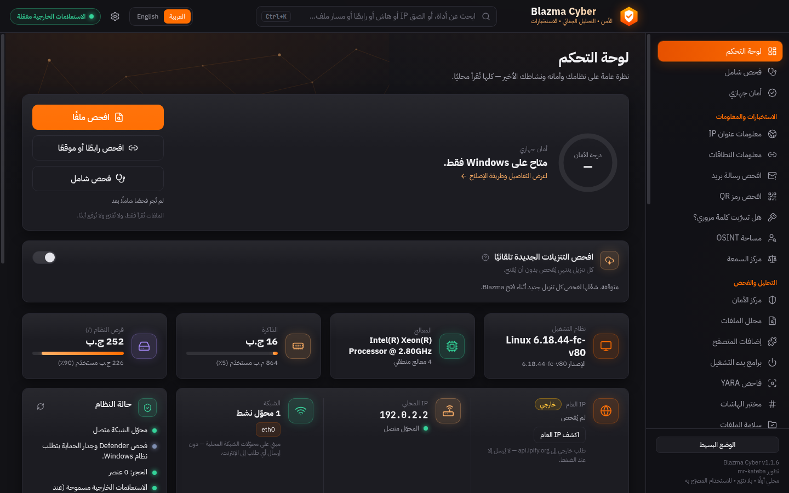

<div dir="rtl">

<p align="center">
  
</p>

<p align="center">
  <a href="https://github.com/mr-kateba/Blazma-Cyber/releases/latest"></a>
  <a href="LICENSE"></a>
  <a href="https://github.com/mr-kateba/Blazma-Cyber/releases"></a>
</p>

# Blazma Cyber — الشرح بالعربي
### الأمن • التحليل الجنائي • الاستخبارات

برنامج سطح مكتب لـ Windows 10/11 للأمن السيبراني الدفاعي، **محلي أولًا وبالعربي والإنجليزي**:
تحليل الملفات، وفحص Defender وYARA، والاستخبارات، والتحليل الجنائي، وأدوات الشبكة، واستعادة كلمات
المرور المصرّح بها، والقضايا والتقارير — في تطبيق واحد. **بلا حساب، بلا تفعيل، بلا تتبّع، ولا يُرسَل
شيء إلا عندما تطلبه أنت.**

تطوير **[mr-kateba](https://github.com/mr-kateba)**

**[⬇ التنزيل](https://github.com/mr-kateba/Blazma-Cyber/releases/latest)** ·
[English README](README.md) ·
[خارطة الطريق](docs/ROADMAP.md) · [الخصوصية](PRIVACY.md) · [الأمان](SECURITY.md)



---

## المحتويات
- [الجديد في 1.1.9](#الجديد-في-119)
- [الجديد في 1.1.8](#الجديد-في-118)
- [الجديد في 1.1.7](#الجديد-في-117)
- [الجديد في 1.1.6](#الجديد-في-116)
- [الجديد في 1.1.5](#الجديد-في-115)
- [الجديد في 1.1.4](#الجديد-في-114)
- [الجديد في 1.1.3](#الجديد-في-113)
- [الجديد في 1.1.2](#الجديد-في-112)
- [الجديد في 1.1.1](#الجديد-في-111)
- [لماذا Blazma Cyber](#لماذا-blazma-cyber)
- [المزايا](#المزايا)
- [التنزيل والتثبيت](#التنزيل-والتثبيت)
- [التشغيل من الكود المصدري](#التشغيل-من-الكود-المصدري)
- [المحركات](#المحركات)
- [الخصوصية والأمان](#الخصوصية-والأمان)
- [حالة المشروع](#حالة-المشروع)
- [حلّ المشاكل](#حلّ-المشاكل)
- [الترخيص](#الترخيص)

---

## الجديد في 1.1.9
- **قوائم كلمات المرور** في «استعادة كلمات المرور»: أضف قوائمك مرة واحدة واخترها من قائمة، مع العدد الدقيق
  لكلمات المرور في كل قائمة وحجمها؛ وتظهر قائمة John المرفقة `password.lst` تلقائيًا عند ضبط John. يتذكّر
  Blazma مكان الملفات فقط — لا ينسخها ولا يعدّلها ولا يحذفها.

## الجديد في 1.1.8
- **سلسلة حفظ الأدلة للقضايا.** كل تغيير في القضية — إضافة دليل أو حذفه، تعديل ملاحظة، الأحداث، بيانات
  القضية، التقارير المصدَّرة (مع بصمة SHA-256 لملف التقرير) — يُسجَّل مع من ومتى في سجل مترابط بالبصمات.
  يعيد Blazma التحقق منه ويُظهر بالضبط ما عُدِّل أو أُضيف أو حُذف خارج البرنامج. احتفظ بـ **البصمة الأخيرة**
  (وهي مطبوعة أيضًا في كل تقرير قضية) لتثبت لاحقًا أن شيئًا لم يتغيّر.
- **فحص دوري مجدول.** فعّل «تكرار تلقائي» في صفحة الفحص الشامل (يوميًا أو أسبوعيًا): مهمة في «جدولة المهام»
  في Windows لحسابك فقط — بلا صلاحيات مسؤول — تفتح Blazma في الخلفية، وتشغّل نفس الفحص للقراءة فقط،
  وتُظهر النتيجة في إشعار. إن فات الموعد يعمل عند تسجيل الدخول التالي، وتوقفه من نفس الصفحة. وصيد
  التهديدات يعرّف هذه المهمة بأنها تابعة لـ Blazma بدل أن ينبّه عليها.
- **سرعة الشبكة الآن** في لوحة التحكم: التنزيل والرفع لحظيًا (kbps/Mbps) مع سجل قصير، من عدّادات
  محوّلات الشبكة المتصلة نفسها، ولا تُقاس إلا ولوحة التحكم مفتوحة.

## الجديد في 1.1.7
- **كرة أرضية حقيقية في «معلومات IP».** يظهر الموقع التقريبي للعنوان على كرة أرضية ثلاثية الأبعاد من صور
  NASA (Blue Marble وBlack Marble، مضمّنة في البرنامج — الكرة نفسها لا تحتاج إنترنت)، والليل والنهار
  مرسومان حسب الوقت الحالي مع الوقت المحلي هناك. اسحب لتدويرها؛ تعمل مع كرت شاشة أو بدونه.
- **الاستعلامات عبر الإنترنت مفعّلة افتراضيًا.** فحوصات كثيرة (معلومات IP والنطاقات، السمعة، كلمات المرور
  المسرّبة، التحديثات) تحتاج إنترنت، لذلك لم يعد البرنامج يبدأ في وضع عدم الاتصال. لا يُرسَل شيء من تلقاء
  نفسه — كل استعلام يبدأ فقط عندما تضغط زره ويظهر في «نشاط الشبكة». ووضع عدم الاتصال بضغطة واحدة من
  **مركز الخصوصية**.

## الجديد في 1.1.6
- **هوية عائلة Blazma الحقيقية.** صار Blazma Cyber يستخدم نفس ألوان Blazma Boost وGet وCrosshair وAI
  وNT: أسطح جرافيت، واللون البرتقالي `#FF6D00`، وأزرار أساسية برتقالية (الإصدار 1.1.5 أخذ لونًا أزرق
  قديمًا بالخطأ). وشريط عنوان النافذة والرسوم والتقارير المطبوعة تتبع نفس الألوان.

## الجديد في 1.1.5
- **هوية عائلة Blazma.** صارت الواجهة تشارك اللون السماوي لعائلة Blazma مع التطبيقات الشقيقة (نفس
  الأزرق عبر العائلة)؛ ومسدّس Blazma البرتقالي يبقى الشعار.

## الجديد في 1.1.4
- **استعادة كلمة المرور صارت تعمل فعلًا.** John وhashcat لا يقرآن الأرشيف مباشرة — يحتاجان استخراج
  «هاش» الملف أولًا. صار Blazma يفعل ذلك تلقائيًا بأدوات John نفسها (rar2john وzip2john)، ثم يشغّل
  المحرك على النتيجة. قبلها كانت كل محاولة تنتهي في 0.0 ثانية بلا نتيجة. (ملفات 7z وPDF وOffice تحتاج
  أدوات استخراج John بلغة Perl/Python؛ أما RAR وZIP فيعملان مباشرة.)

## الجديد في 1.1.3
- **التعرّف على ملفات RAR المحمية بكلمة مرور.** ملف RAR تحتاج ملفاته كلمة مرور لكن أسماءها ظاهرة (الإعداد
  الافتراضي في WinRAR) كان يظهر «غير مشفّر». صار Blazma يقرأ محتويات الأرشيف نفسها: RAR5 وRAR من 1.5
  إلى 4، مع تشفير الأسماء أو بدونه. وكذلك أرشيفات 7z ومستندات Office 97-2003. وإذا لم يستطع الملف أن
  يؤكد أيًّا من الحالتين تخبرك الصفحة بذلك وتسمح لك بالمتابعة.
- **إصلاح:** ملفات Office القديمة وملفات التثبيت ورسائل Outlook كانت تظهر خطأً «مشفّرة» في محلل الملفات.

## الجديد في 1.1.2
- **افحص رمز QR قبل أن تمسحه.** أفلت صورة أو لقطة شاشة، أو الصقها (Ctrl+V)، واعرف بالضبط ماذا يحتوي
  الرمز: رابط (عنوان IP، موقع مقلّد أو مختصر، غير مشفّر، وجهة مخفية)، دخول شبكة واي فاي، رمز إعداد تحقق
  بخطوتين، طلب دفع بعملة رقمية، رسالة SMS مدفوعة… لا يُفتح أي شيء، ولا تُعرض كلمات مرور الواي فاي ولا
  أسرار التحقق بخطوتين أبدًا.
- **ملفات Outlook ‏‎.msg في «افحص رسالة بريد».** اسحب الرسالة من Outlook وأفلتها — يعمل عليها نفس فحص
  التصيّد (الترويسات الأصلية، الروابط، المرفقات، الرسائل المرفقة). وإذا لم يحتفظ Outlook بترويسات
  الإنترنت (الرسائل المرسلة أو المسودات) تخبرك الصفحة بذلك.
- **تقرير الفحص الشامل.** احفظ نتيجة الفحص تقرير PDF أو HTML (الحالات والأعداد فقط — بلا مسارات أو
  عناوين).
- **إصلاح تعطّل.** فحص الحسابات باسم المستخدم (OSINT) لم يعد يتعطّل عندما يرسل موقع رموزًا تعبيرية أو
  حروفًا عربية في ترويسات الرد.

## الجديد في 1.1.1
- **استعادة كلمة المرور — استغلال عتاد جهازك.** اختر مقدار استغلال المحرك (الذي تثبّته أنت) لملفاتك:
  **متوازن** (يترك الجهاز صالحًا للاستخدام) أو **أقصى** (كل أنوية المعالج، ومع hashcat كرت الشاشة
  بالكامل). ومع hashcat تختار المعالِج: تلقائي / كرت الشاشة / المعالج. يؤثّر على السرعة فقط، والنتيجة
  تبقى محلية ولا تُسجَّل.
- **تنبيه الأجهزة الجديدة في شبكتك.** عند اكتشاف الأجهزة، يعلّم البرنامج كل جهاز: **جديد / شوهد سابقًا
  / موثوق**، ويعدّ ما ظهر لأول مرة، ويعرض الأجهزة المحفوظة التي لم ترد. زر «وثّق كل الأجهزة الحالية»
  ليبرز الجديد الحقيقي فقط في المرة القادمة.
- **إصلاح الشعار.** يظهر شعار Blazma الآن في شريط المهام والإشعارات (بدل شعار Electron) — سواء ثبّتّه
  أو شغّلته من الكود المصدري.
- **زر «إيقاف مبكر»** في تسجيل حركة الشبكة (pktmon) صار يوقف التسجيل فورًا ويحلّل ما سُجّل.
- **صفحة استعادة كلمة المرور** فيها أزرار مباشرة للمواقع الرسمية لمحركي John the Ripper وhashcat مع
  خطوات التجهيز.

سابقًا في **1.1.0**: مركز الواي فاي، تحليل وتسجيل حركة الشبكة، فحص الخدمات (Nmap)، مراقبة سلامة
الملفات، «ما يبدأ مع Windows»، المنافذ المفتوحة، الفحص الشامل بضغطة واحدة، البحث الذكي (Ctrl+K)،
السمة الفاتحة، وأسماء الشركات المصنّعة للأجهزة بدون إنترنت. السجل الكامل في
[docs/ROADMAP.md](docs/ROADMAP.md).

---

## لماذا Blazma Cyber
- **محلي وخاص.** كل شيء يعمل على جهازك. الاستعلامات الخارجية **لا تبدأ إلا عندما
  تطلبها أنت**، وكل محاولة تظهر في «نشاط الشبكة»، و**وضع عدم الاتصال** يحجبها كلها بضغطة واحدة.
- **لا يختلق النتائج أبدًا.** عند تعذّر تحديد شيء يقول *«غير متاح»* مع السبب — لا رقم وهمي ولا «سليم»
  زائف.
- **يدمج ولا يعيد الاختراع.** يشغّل محركات ناضجة (Microsoft Defender وYARA-X وcapa وNmap وJohn/hashcat…)
  عبر واجهات نظيفة، ويذكر دائمًا أي محرك أنتج النتيجة.
- **بالعربي أولًا.** عربي كامل (RTL) وإنجليزي، بتبديل فوري؛ والقيم التقنية (IP، الهاشات، المسارات) تبقى
  من اليسار لليمين داخل النص العربي.
- **للجميع.** «وضع بسيط» بنتائج بكلام واضح للمستخدم العادي، والأدوات الكاملة للمحترفين.

---

## المزايا

### 🛡️ الأمن والتحليل
- **لوحة التحكم** — نظام التشغيل والمعالج والذاكرة والقرص ومحوّلات الشبكة بمؤشرات حيّة، وحالة Defender
  والجدار الناري (Windows)، والنشاط الأخير، ونتيجة آخر فحص شامل. الـ IP العام عند الطلب فقط.
- **محلل الملفات** — هاشات MD5/SHA-1/SHA-256/SHA-512 بالبثّ، نوع الملف من بصمته، الإنتروبيا، ترويسة PE
  وأقسامه واستيراده، مؤشرات الاختراق المضمّنة، النصوص المهمة، التوقيع الرقمي (Windows)، كشف الملفات
  المشفّرة، وDefender وYARA-X اختياريًا، وسمعة عبر الهاش، وتقييم مجمّع لا يقول «سليم» عند غياب المحركات.
  **الملفات لا تُشغَّل أبدًا.**
- **مركز الأمان** — فحوص Defender السريع/الكامل/ملف/مجلد (فحوص الملف والمجلد للتقرير فقط)، سجل التهديدات،
  والحجر.
- **الحجر** — تخزين مُبطَّل (XOR)، واستعادة مع تحقق SHA-256؛ لا يُحذف شيء تلقائيًا.
- **فاحص YARA** — واجهة لأداة YARA-X (`yr`) التي تثبّتها، مع مدير قواعد يتحقق منها.
- **مختبر الهاشات** — حساب هاش لنص أو ملف، التحقق، التعرّف على النوع (باحتمالات مرتّبة)، والمقارنة.
- **مراقبة سلامة الملفات** — خذ بصمة SHA-256 لمجلد ثم اعرف بدقة ما أُضيف أو حُذف أو تغيّر؛ ينبّه للتعديلات
  التي أبقت التاريخ القديم وللملفات القابلة للتشغيل. أماكن مقترحة: مجلدات بدء التشغيل، ملف hosts، ملفات
  PowerShell.

### 🔎 الاستخبارات
- **معلومات IP والنطاقات** — DNS العكسي، RDAP، ASN (Team Cymru)، موقع تقريبي (ipinfo) على كرة أرضية ثلاثية الأبعاد، فحص خروج Tor،
  سجلات DNS، SPF/DMARC، شهادة TLS، والبنية المستضيفة.
- **مركز السمعة** — VirusTotal وAbuseIPDB وShodan وabuse.ch (MalwareBazaar وURLhaus وThreatFox — مفتاح
  مجاني واحد) بمفاتيحك **أنت** (هاشات، بلا رفع أبدًا).
- **افحص رسالة بريد** — تحليل تصيّد محلي لملف `.eml` محفوظ أو ملف Outlook ‏`.msg` أو مصدر ملصوق: انتحال المرسل، SPF/DKIM/DMARC،
  الروابط الخادعة، والمرفقات الخطرة (تُحال لمحلل الملفات، ولا تُفتح أبدًا).
- **هل تسرّبت كلمة مروري؟** — عبر Have I Been Pwned بتقنية k-anonymity: تخرج 5 أحرف فقط من هاش SHA-1
  لكلمة المرور من الجهاز.
- **تحليل سجلات الأحداث** — Hayabusa المضمّن مع أكثر من 4000 قاعدة Sigma على ملفات `.evtx` أو سجلات هذا
  الجهاز (صلاحيات المسؤول تُطلب لهذا الفحص فقط، مع شرح).
- **مساحة OSINT** — نطاق أو بريد أو اسم مستخدم أو رابط: شفافية الشهادات (crt.sh)، أرشيف Wayback، ملف
  GitHub، DNS لنطاق البريد؛ و**حسابات باسم مستخدم** عبر 301 موقع تواصل (و338 موقعًا آخر اختياريًا) عبر
  قواعد WhatsMyName — موجود / غير موجود / تعذّر الفحص، بلا تخمين.

### 🌐 الشبكة
- **الواي فاي** — اتصالك الحالي (الأمان بكلام بسيط، الإشارة، النطاق/القناة، السرعة)، الشبكات القريبة مع
  كشف الشبكة المنتحِلة (Evil Twin) ومخطط القنوات، ومراجعة الشبكات المحفوظة — **قراءة فقط، ولا تُقرأ كلمات
  المرور أبدًا.**
- **حركة الشبكة** — حلّل ملفات `.pcap`/`.pcapng`، أو سجّل من 15 ثانية إلى 5 دقائق بأداة **pktmon** المدمجة
  في Windows (نافذة UAC واحدة) أو بـ **dumpcap** من Wireshark: الأجهزة وشركاتها المصنّعة، المحادثات، DNS،
  مواقع HTTPS، تسجيلات الدخول غير المشفّرة، وأنماط مثل فحص المنافذ وانتحال ARP وخادم DHCP دخيل وTLS قديم.
  الكوكيز وكلمات المرور ومحتوى الصفحات لا تدخل التقرير.
- **فحص الخدمات (Nmap)** — بـ Nmap الذي تثبّته **أنت**: من المتصل بشبكتك وما الخدمات المفتوحة على كل جهاز
  (100 أو 1000 منفذ) مع شرح الخطورة. لشبكاتك أنت فقط، وبعد تأكيد التصريح.
- **المنافذ المفتوحة على جهازك** — أي البرامج تنتظر اتصالات، وهل يصل إليها جهازك فقط أم الشبكة، وما وظيفة
  كل منفذ معروف.
- **أدوات الشبكة** — ping، وtraceroute، وDNS، وDNS العكسي، والمسارات، وARP، والمحوّلات؛ وفحص المنافذ
  واكتشاف شبكة /24 المحلية (مع **تتبّع الأجهزة الجديدة**) يحتاجان تأكيد تصريح صريح.

### 🧪 التحليل الجنائي والصيد
- **التحليل الجنائي لويندوز** — جامعات قراءة فقط: العمليات، الاتصالات، الخدمات، التعريفات، بدء التشغيل،
  المهام المجدولة، المستخدمون، البرامج، سجل USB، وسجلات الأحداث (بدائل Linux عبر `/proc`).
- **ما يبدأ مع Windows** — برامج بدء التشغيل مع من وقّعها وأين توجد؛ وتنبيه للبرامج غير الموقّعة في مجلدات
  المستخدم ولما يعمل عبر مشغّلات السكربتات (rundll32، PowerShell، mshta…).
- **علامات العبث وإضافات المتصفح** — ملف hosts، البروكسي، خوادم DNS، وشهادات الجذر المضافة؛ وما يمكن لكل
  إضافة فعله وكيف ثُبّتت. و**مراقبة التنزيلات** اختياريًا.
- **صيد التهديدات** — ربط IP/نطاق/هاش/نص عبر القضايا والحجر والنشاط وسجل الشبكة والعمليات والاتصالات
  والخدمات وبدء التشغيل الحيّة وقواعد YARA؛ ومراجعة وسائل البقاء.
- **فحص الذاكرة** — HollowsHunter المضمّن يبحث عن تعليمات مخفية أو معدّلة في البرامج قيد التشغيل.

### 🔐 الاستعادة والتحقيقات
- **استعادة كلمات المرور** — للملفات **التي تملكها أو المصرّح لك باستعادتها**: كشف الملفات المشفّرة
  (ZIP/7z/RAR/PDF/Office) + محرك John the Ripper / hashcat الخاص بك، مع **تحكم بالموارد** (متوازن/أقصى،
  وكرت الشاشة/المعالج مع hashcat). النتيجة تُعرض مرة واحدة و**لا تُسجَّل أبدًا.**
- **القضايا** — `CASE-YYYY-NNN`، أدلة مقابل ملاحظات، خط زمني تلقائي، «أضف إلى قضية» من أي وحدة،
  **سلسلة حفظ أدلة** مترابطة بالبصمات، وتصدير مؤشرات الاختراق (CSV / STIX 2.1).
- **التقارير** — HTML (مهرّب، بلا سكربتات، بسياسة CSP صارمة)، وJSON، وPDF، بالعربي (RTL) أو الإنجليزي.

### 👤 للجميع
- **فحص شامل** — بضغطة واحدة: أمان الجهاز، علامات العبث، برامج بدء التشغيل، إضافات المتصفح، الواي فاي،
  المنافذ المفتوحة، والمجلدات المراقَبة — بـ **نتيجة واحدة واضحة** ورابط لتفاصيل كل قسم. ولوحة التحكم تتذكّر
  آخر نتيجة، ويمكنك حفظها تقرير PDF/HTML، أو جعلها **تتكرر يوميًا/أسبوعيًا** مع إشعار.
- **افحص رمز QR** — ماذا يحتوي الرمز قبل أن تمسحه بهاتفك: تحذيرات الروابط، دخول شبكات الواي فاي، رموز
  التحقق بخطوتين، طلبات الدفع، رسائل SMS المدفوعة. يُقرأ محليًا، ولا يُفتح أي شيء.
- **أمان جهازي** — درجة من 100 من فحوص قراءة فقط على Windows، كل فحص مشروح بالعربي/الإنجليزي مع طريقة
  الإصلاح (البرنامج لا يغيّر الإعدادات).
- **الوضع البسيط** — الأساسيات فقط، ونتائج بكلام واضح، وزر «ماذا يعني هذا؟» على المصطلحات، وأفلت أي ملف في
  أي مكان لفحصه.
- **البحث الذكي (Ctrl+K)** — الصق IP أو هاش أو نطاقًا أو رابطًا أو بريدًا أو @اسم مستخدم أو مسار ملف (حتى
  المكتوب بصيغة `hxxp` و`[.]`) وانتقل مباشرة للأداة المناسبة والقيمة جاهزة.
- **السمات** — كحلي داكن، أسود ليلي، فاتح، أو «مثل إعداد Windows».

### 🔒 الخصوصية واللغة
- **مركز الخصوصية** — وضع عدم الاتصال (بضغطة واحدة، غير مفعّل افتراضيًا)، وسجل بكل طلب خارجي، وأدوات مسح البيانات المحلية.
- **العربية والإنجليزية** — ترجمة كاملة، وتبديل RTL/LTR فوري، والقيم التقنية تبقى LTR.

---

## التنزيل والتثبيت

### الطريقة أ — المثبّت (الأسهل)
1. افتح **[صفحة الإصدارات](https://github.com/mr-kateba/Blazma-Cyber/releases/latest)** ونزّل
   `Blazma-Cyber-<الإصدار>-x64-setup.exe` من قسم **Assets**. لا يحتاج تسجيل دخول.
2. المثبّت **غير موقّع بشهادة توقيع كود** بعد (التوقيع يحتاج شهادة مدفوعة)، لذلك ستظهر رسالة
   **"Windows protected your PC"** ← اضغط **More info** ثم **Run anyway**.
3. التثبيت **للمستخدم الحالي، بلا صلاحيات مسؤول**، وينشئ اختصارات على سطح المكتب وقائمة ابدأ.

> **بدون تثبيت؟** نزّل `Blazma-Cyber-<الإصدار>-x64-portable.zip`، فكّ الضغط في أي مجلد أو ذاكرة USB،
> وشغّل `Blazma Cyber.exe`. كل البيانات تبقى في مجلد `Blazma-data` بجانبه.

**تحقّق أن الملف سليم وأصلي:**
- **البصمة:** `Get-FileHash .\Blazma-Cyber-<الإصدار>-x64-setup.exe -Algorithm SHA256` وقارنها بملف
  `SHA256SUMS.txt` وبصفحة الإصدار.
- **شهادة مصدر البناء:** `gh attestation verify .\Blazma-Cyber-<الإصدار>-x64-setup.exe -R mr-kateba/Blazma-Cyber`
  تثبت أن الملف بُني من هذا المستودع عبر GitHub Actions ولم يُعدَّل بعدها (تحتاج [GitHub CLI](https://cli.github.com)).

### أول تشغيل
- اختر اللغة (العربية / English)، ويمكن تغييرها لاحقًا من الإعدادات.
- **الاستعلامات الخارجية مسموحة** افتراضيًا، لكنها لا تبدأ إلا عندما تضغط زرها (مثل معلومات IP أو
  VirusTotal). إن أردت حجبها كلها فعّل **وضع عدم الاتصال** من **مركز الخصوصية**.

### الإزالة
- **الإعدادات ← التطبيقات ← Blazma Cyber ← إزالة التثبيت**.
- بياناتك (الإعدادات، القضايا، التقارير، الحجر) **تبقى** في `%APPDATA%\Blazma Cyber`. لحذفها: من **مركز
  الخصوصية ← مسح البيانات المحلية** قبل الإزالة، أو احذف المجلد يدويًا.

---

## التشغيل من الكود المصدري

**المتطلبات:** Windows 10/11 64-bit، و[Node.js 20 أو أحدث](https://nodejs.org) (يُفضّل 22 LTS)، وGit.

```powershell
git clone https://github.com/mr-kateba/Blazma-Cyber.git Blazma-Cyber
cd Blazma-Cyber
.\Start-Blazma.ps1 -Install     # أول مرة: يثبّت الاعتماديات، يبني البرنامج، ويشغّله
.\Start-Blazma.ps1              # المرات التالية
```

| الخيار | الوظيفة |
|---|---|
| `-Install` | تثبيت الاعتماديات (لا يثبّت شيئًا بدون هذا الخيار) |
| `-Dev` | وضع التطوير مع إعادة التحميل التلقائي |
| `-SkipBuild` | التشغيل بدون إعادة البناء |

لبناء المثبّت بنفسك على Windows: `npm ci` ثم `npm run dist:win` (الناتج في `release\`).

---

## المحركات

**مضمّنة** في مثبّت Windows (تُنزّل من إصداراتها الرسمية وقت البناء وتُثبَّت ببصمات SHA-256 — البرنامج
نفسه لا ينزّل شيئًا):
- **YARA-X** مع **1,240 قاعدة من ReversingLabs** لكشف عائلات البرامج الضارة.
- **capa** (Mandiant): «ماذا يستطيع هذا البرنامج أن يفعل؟» مع رموز MITRE ATT&CK.
- **Detect It Easy**: بماذا بُني الملف وهل هو مضغوط/محمي.
- **Hayabusa** (أكثر من 4000 قاعدة Sigma): صيد في سجلات أحداث Windows.
- **HollowsHunter**: فحص الشيفرات المخفية في الذاكرة.

**اختيارية تثبّتها أنت** (البرنامج لا ينزّل أو يشغّل أي ملف تنفيذي تلقائيًا):

| المحرك | الفائدة | الإعداد |
|---|---|---|
| Microsoft Defender | فحص الملفات والمجلدات | موجود مع Windows — لا يحتاج إعدادًا |
| Nmap ([nmap.org](https://nmap.org)) | فحص الخدمات في شبكتك | ثبّته ثم افتح صفحة «فحص الخدمات» — يُكتشف تلقائيًا |
| Wireshark + Npcap | تسجيل حركة الشبكة بلا صلاحيات مسؤول وفتح التسجيلات | ثبّته — بدونه يُستخدم pktmon المدمج |
| John the Ripper ([openwall](https://www.openwall.com/john/)) / hashcat ([hashcat.net](https://hashcat.net/hashcat/)) | استعادة كلمات المرور لملفاتك المصرّح بها | **الإعدادات ← المحركات** ثم اختر الملف التنفيذي |
| مفاتيح VirusTotal / AbuseIPDB / Shodan / abuse.ch | فحص السمعة (مفتاح abuse.ch مجاني ويشغّل الثلاثة) | **الإعدادات ← مفاتيح API** (تُحفظ مشفّرة بـ DPAPI) |

---

## الخصوصية والأمان
- **لا تتبّع، لا حساب، لا رفع تلقائي.** وضع عدم الاتصال يحجب كل طلب خارجي قبل فتح الاتصال، وكل محاولة تظهر
  في «نشاط الشبكة» (المضيف وفئة البيانات فقط).
- **الواجهة معزولة** (contextIsolation وCSP صارمة)؛ وكل وسيط IPC يُعاد التحقق منه في العملية الرئيسية؛ ولا
  سلاسل صدفة؛ وPowerShell يشغّل سكربتات ثابتة بمعطيات عبر متغيرات البيئة.
- **الأسرار** تُحفظ بـ DPAPI (safeStorage)، والسجلات تُخفي المفاتيح والرموز وكلمات المرور تلقائيًا.
- **الملفات المحلَّلة لا تُشغَّل أبدًا**، والبرنامج لا يعطّل Defender ولا يغيّر الجدار الناري.
- التفاصيل: [PRIVACY.md](PRIVACY.md) · [SECURITY.md](SECURITY.md) · [docs/ARCHITECTURE.md](docs/ARCHITECTURE.md).

---

## حالة المشروع
**الإصدار 1.1.9 (مستقر).** مُتحقَّق منه آليًا على Windows حقيقي (Server 2025، نفس أساس Windows 11 24H2)
عبر الفحص التلقائي: استعلامات PowerShell، حالة Defender وفحص ملف EICAR، التوقيع الرقمي، التحليل الجنائي،
أدوات الشبكة، تسجيل pktmon حقيقي، قارئ الواي فاي، مراجعة بدء التشغيل والتواقيع، الواجهة كاملة، وبناء المثبّت.

**لم يُختبر بعد يدويًا:** الواي فاي على جهاز فيه كرت واي فاي، Nmap على Windows، التثبيت/الإزالة على سطح
مكتب Windows 10/11، فحص Defender السريع/الكامل، ومحركات John/hashcat الحقيقية. التفاصيل:
[docs/ROADMAP.md](docs/ROADMAP.md).

---

## حلّ المشاكل

| المشكلة | الحل |
|---|---|
| "Windows protected your PC" / المتصفح يحذّر من الملف | المثبّت غير موقّع ← **More info ← Run anyway** / احتفظ بالملف |
| أيقونة البرنامج تبدو عامة | Windows يخزّن الأيقونات — شغّل `ie4uinit.exe -show` أو أعد التشغيل؛ وأعد تثبيت أي اختصار قديم في شريط المهام |
| "Node.js was not found" | ثبّت Node.js 20+ وأعد فتح PowerShell (التشغيل من المصدر فقط) |
| تشغيل السكربتات معطّل | `powershell -ExecutionPolicy RemoteSigned -File .\Start-Blazma.ps1` أو `Unblock-File .\Start-Blazma.ps1` |
| "Blocked by Offline Mode" / "محجوب: وضع عدم الاتصال" | طبيعي — أوقف وضع عدم الاتصال من **مركز الخصوصية** إن أردت الاستعلامات الخارجية |
| حالة Defender "غير متاحة" | قد يكون برنامج حماية آخر مثبّتًا، أو Defender معطّل بسياسة |

---

## الاستخدام المصرّح به
مخصّص للاستخدام **الدفاعي** على الأجهزة والشبكات والملفات التي تملكها أو المصرّح لك بفحصها.

## الترخيص
حقوق النشر © 2026 [mr-kateba](https://github.com/mr-kateba).

البرنامج مفتوح المصدر بترخيص **GNU GPL الإصدار 3 أو أحدث** ([LICENSE](LICENSE)):
- تقدر تستخدمه وتنسخه وتعدّله وتوزّعه بحرية.
- أي شخص يوزّع نسخة معدّلة **لازم ينشر كودها بنفس الترخيص** ويذكر المصدر، فلا أحد يقدر يغلقه أو يبيعه مغلقًا.
- البرنامج يُقدَّم **بدون أي ضمان**.

الأدوات والمكتبات الخارجية لها تراخيصها: [THIRD-PARTY-NOTICES.md](THIRD-PARTY-NOTICES.md).

</div>
