<p align="center">
  
</p>

<p align="center">
  <a href="https://github.com/mr-kateba/Blazma-Cyber/releases/latest"></a>
  <a href="LICENSE"></a>
  <a href="https://github.com/mr-kateba/Blazma-Cyber/releases"></a>
</p>

<div align="center">

# Blazma Cyber
### Security • Forensics • Intelligence
**الأمن • التحليل الجنائي • الاستخبارات**

A privacy-first, local-first, bilingual (العربية / English) Windows cybersecurity workbench.
One desktop app for defensive security, file analysis, intelligence, forensics, network
diagnostics, authorized password recovery, cases and reports — **no account, no activation,
no telemetry.**

By **[mr-kateba](https://github.com/mr-kateba)**

**[⬇ Download](https://github.com/mr-kateba/Blazma-Cyber/releases/latest)** ·
**[الشرح بالعربي — التنزيل والتثبيت](README.ar.md)** ·
[Roadmap](docs/ROADMAP.md) · [Privacy](PRIVACY.md) · [Security](SECURITY.md)

</div>


---

## Table of contents
- [What's new in 1.1.6](#whats-new-in-116)
- [What's new in 1.1.5](#whats-new-in-115)
- [What's new in 1.1.4](#whats-new-in-114)
- [What's new in 1.1.3](#whats-new-in-113)
- [What's new in 1.1.2](#whats-new-in-112)
- [What's new in 1.1.1](#whats-new-in-111)
- [Why Blazma Cyber](#why-blazma-cyber)
- [Features](#features)
- [Install](#install)
- [Build from source](#build-from-source)
- [Engines](#engines)
- [Privacy & security](#privacy--security)
- [Project status](#project-status)
- [Troubleshooting](#troubleshooting)
- [License](#license)

---

## What's new in 1.1.6
- **The real Blazma family look.** Blazma Cyber now uses the same palette as Blazma Boost, Get,
  Crosshair, AI and NT: graphite surfaces, the orange `#FF6D00` accent and solid orange primary
  buttons (1.1.5 had picked an older blue palette by mistake). Window title bar, charts and printed
  reports follow it too.

## What's new in 1.1.5
- **Blazma family look.** The interface now shares the Blazma family sky accent with the sibling
  apps (same blue across the family); the orange Blazma hexagon stays the logo.

## What's new in 1.1.4
- **Password recovery actually runs now.** John and hashcat can't read an archive directly — they
  need the file's "hash" extracted first. Blazma now does that automatically with John's own
  `rar2john`/`zip2john` tools, then runs the engine on the result. Before, every run finished in
  0.0s finding nothing. (7z/PDF/Office need John's Perl/Python extractors installed; RAR and ZIP
  work out of the box.)

## What's new in 1.1.3
- **Password-protected RAR files are recognized.** A RAR whose files need a password but whose file
  names are visible (WinRAR's default) was shown as "not encrypted". Blazma now reads the archive's
  entries: RAR5 and RAR 1.5–4, with or without encrypted file names. 7z archives and Office
  97-2003 documents are read the same way, and when a file can't confirm it either way the page
  says so and still lets you continue.
- **Fix:** old-format Office files, installers and Outlook messages were wrongly shown as
  "encrypted" in the File Analyzer.

## What's new in 1.1.2
- **Check a QR code before you scan it.** Drop a photo or screenshot, or paste one (Ctrl+V), and
  see exactly what the code contains: a link (IP address, look-alike or shortened site, unencrypted,
  hidden destination), a Wi-Fi login, a two-factor setup code, a crypto payment request, a premium
  SMS… Nothing is opened; Wi-Fi passwords and 2FA secrets are never shown.
- **Outlook `.msg` files in "Check an email".** Drag a message out of Outlook and drop it — the same
  phishing analysis runs on it (original headers, links, attachments, attached emails). If Outlook
  didn't keep the internet headers (sent items, drafts), the page says so.
- **Full checkup report.** Save the checkup result as a PDF or HTML report (states and counts only —
  no paths or addresses).
- **Crash fix.** The OSINT username check no longer crashes when a site sends an emoji or Arabic
  text in a response header.

## What's new in 1.1.1
- **Password recovery — use your hardware.** Choose how hard the (user-installed) engine works on
  files you own: **Balanced** (keeps the computer usable) or **Maximum** (every CPU core; with
  hashcat, the full graphics-card workload). With hashcat you also pick the processor — Automatic,
  Graphics card, or CPU. Speed only; the result stays local and is never logged.
- **New-device alert on your network.** A discovery scan now marks each device **New / Seen before /
  Trusted**, counts the ones seen for the first time, and lists saved devices that did not answer.
  "Trust all current devices" so only genuinely new ones stand out next time.
- **Icon fix.** The Blazma logo now shows on the Windows taskbar and in notifications (not
  Electron's), whether installed or run from source.
- **"Stop early" for live captures** now stops the elevated pktmon recording immediately and
  analyses what was captured, instead of waiting out the timer.
- **Password recovery page** links to the official John the Ripper and hashcat sites with setup steps.

Earlier: **1.1.0** added Wi-Fi Center, network-traffic analysis & capture, the Nmap service scan,
the file-integrity monitor, "what starts with Windows", open-ports, the one-click full checkup,
smart search (Ctrl+K), a light theme, and offline device-manufacturer names. Full history in
[docs/ROADMAP.md](docs/ROADMAP.md).

---

## Why Blazma Cyber
- **Local-first & private.** Everything runs on your machine. **Offline Mode is on by default**; no
  external request leaves until you allow it, and every attempt is listed in Network Activity.
- **Never fabricates results.** When something can't be determined, it says *unavailable* with the
  reason — never a placeholder number or a fake "clean".
- **Integrates, doesn't reinvent.** It drives mature engines (Microsoft Defender, YARA-X, capa,
  Nmap, John/hashcat…) through clean adapters and always says which engine produced a result.
- **Bilingual, Arabic-first.** Full Arabic (RTL) and English, switchable live; technical values
  (IPs, hashes, paths) stay left-to-right inside Arabic text.
- **For everyone.** A Simple mode with plain-language verdicts for everyday users, and the full
  expert toolset for professionals.

---

## Features

### 🛡️ Security & analysis
- **Dashboard** — real OS, CPU, memory, disk and network adapters with live gauges, Defender and
  firewall status (Windows), recent activity, and the last full-checkup verdict. Public IP only on request.
- **File Analyzer** — streaming MD5/SHA-1/SHA-256/SHA-512, file type by magic bytes, entropy, PE
  headers/sections/imports/exports, embedded IOCs, notable strings, Authenticode (Windows),
  encrypted-file detection, optional Defender + YARA-X, hash-only reputation, and a combined
  assessment that never claims "clean" when engines are missing. **Files are never executed.**
- **Security Center** — Microsoft Defender quick / full / file / folder scans (file & folder scans
  are report-only), threat history, quarantine view.
- **Quarantine** — neutralized (XOR) storage, SHA-256-verified restore; nothing is deleted automatically.
- **YARA scanner** — adapter to the user-installed YARA-X `yr` CLI with a validating rule manager.
- **Hash Lab** — hash text/files, verify, identify formats (ranked), and compare.
- **File integrity monitor** — fingerprint a folder (SHA-256 of every file), then see exactly what
  was added, removed or changed; flags content edits that kept the old timestamp and changed files
  that can run code. Suggested places: Startup folders, the hosts folder, PowerShell profiles.

### 🔎 Intelligence
- **IP / Domain Intelligence** — reverse DNS, RDAP, Team Cymru ASN, approximate location (ipinfo),
  Tor exit check, DNS records, SPF/DMARC, TLS certificate, hosting infrastructure.
- **Reputation Center** — VirusTotal, AbuseIPDB, Shodan and abuse.ch (MalwareBazaar, URLhaus,
  ThreatFox — one free key) with **your own** keys (hashes, never uploads).
- **Check an email** — local phishing analysis of a saved `.eml`, an Outlook `.msg` or pasted source: sender spoofing,
  SPF/DKIM/DMARC, deceptive links, dangerous attachments (handed to the File Analyzer, never opened).
- **Was my password leaked?** — Have I Been Pwned via k-anonymity: only 5 characters of the
  password's SHA-1 hash ever leave the computer.
- **Event-log hunting** — bundled Hayabusa with 4,000+ Sigma rules over `.evtx` files or this
  computer's logs (administrator rights requested only for that one scan, with an explanation).
- **OSINT Workspace** — domain, email, username or URL: Certificate Transparency (crt.sh), Wayback
  Machine, GitHub profile, mail-domain DNS; **accounts by username** across 301 social networks
  (+338 other sites, optional) via WhatsMyName — found / not found / couldn't check, never guessed.

### 🌐 Network
- **Wi-Fi** — current connection (security in plain words, signal, band/channel, link speed), nearby
  networks with an evil-twin check and a channel chart, and an audit of saved networks — **read-only,
  passwords are never read.**
- **Network traffic** — analyse `.pcap`/`.pcapng` files, or record 15 s – 5 min with Windows **pktmon**
  (one UAC prompt) or Wireshark's **dumpcap**: devices with manufacturers, conversations, DNS, HTTPS
  sites, unencrypted logins, and measured patterns (port scan, ARP conflict, rogue DHCP, outdated
  TLS…). Cookies, passwords and page contents never enter the report.
- **Service scan (Nmap)** — with **your own** Nmap install: who is online and which services each
  device exposes (100 / 1,000 ports), with plain-language risks. Only your own networks, after an
  authorization confirmation.
- **Open ports on this PC** — which programs wait for connections, whether only this PC or the
  network can reach them, and what each well-known port usually is.
- **Network Toolkit** — ping, traceroute, DNS, reverse DNS, routes, ARP, adapters; port check and
  local /24 discovery (with **new-device tracking**) require an explicit authorization confirmation.

### 🧪 Forensics & hunting
- **Windows Forensics** — read-only collectors: processes, connections, services, drivers, startup,
  scheduled tasks, users, software, USB history, event logs (Linux `/proc` fallbacks).
- **What starts with Windows** — startup programs with who signed them and where they live; unsigned
  programs in user folders and script launchers (rundll32, PowerShell, mshta…) are highlighted.
- **Signs of tampering & browser extensions** — hosts file, proxy, DNS and added root certificates;
  what each add-on may do and how it was installed. Opt-in **Downloads watcher**.
- **Threat Hunting** — correlate an IP/domain/hash/text across cases, quarantine, activity, the
  network log, live processes/connections/services/startup and YARA rules; persistence review.
- **Memory scan** — bundled HollowsHunter looks for code hidden or modified in running programs.

### 🔐 Recovery & investigations
- **Password Recovery** — for files **you own or are authorized to recover**: encrypted-file
  detection (ZIP/7z/RAR/PDF/Office) + your own John the Ripper / hashcat, with a **resource control**
  (Balanced / Maximum, and GPU/CPU for hashcat). Results are shown once and **never logged.**
- **Cases** — `CASE-YYYY-NNN`, evidence vs. notes, automatic timeline, "Add to case" from any module,
  IOC export (CSV / STIX 2.1).
- **Reports** — HTML (escaped, script-free, strict CSP), JSON and PDF, in Arabic (RTL) or English.

### 👤 For everyone
- **Full checkup** — one click runs device security, signs of tampering, startup programs, browser
  extensions, Wi-Fi, open ports and watched folders, and gives **one plain verdict** with a link to
  each area's evidence. The dashboard remembers the last result; save it as a PDF/HTML report.
- **QR Code Check** — what a QR code contains before you scan it with your phone: link warnings,
  Wi-Fi logins, 2FA setup codes, payment requests, premium SMS. Decoded locally; nothing is opened.
- **Device Security** — a score out of 100 from read-only Windows checks, each explained in plain
  Arabic/English with how to fix it (Blazma never changes settings).
- **Simple mode** — only the essentials, plain-language verdicts, a "What does this mean?" button on
  technical terms, and drop a file anywhere to scan it.
- **Smart search (Ctrl+K)** — paste an IP, hash, domain, link, e-mail, @username or file path
  (defanged `hxxp` / `[.]` too) and jump straight to the right tool, pre-filled.
- **Themes** — deep navy, midnight black, light, or match Windows.

### 🔒 Privacy & language
- **Privacy Center** — Offline Mode (on by default), a log of every external request, and clear-data controls.
- **Arabic & English** — full translation, live RTL/LTR switching, technical values kept LTR.

| | |
|---|---|
| 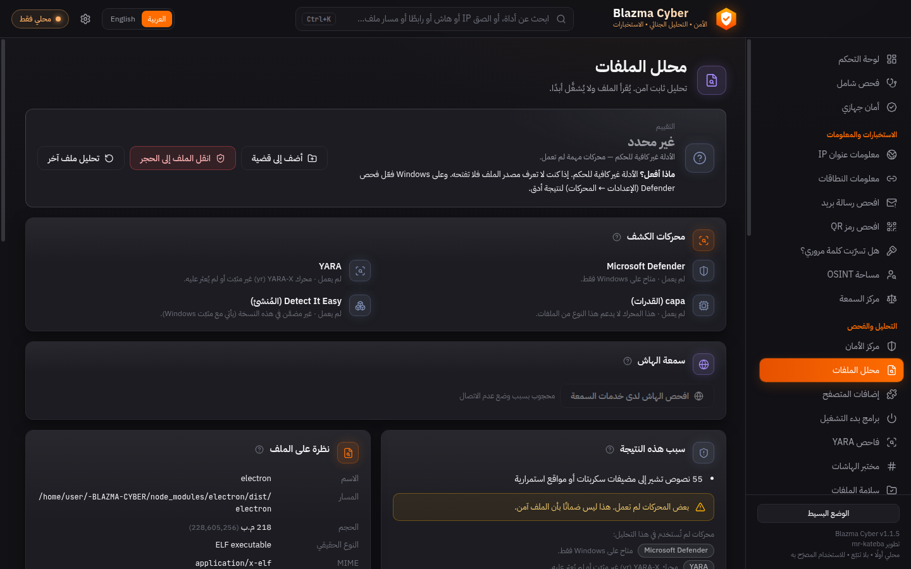 | 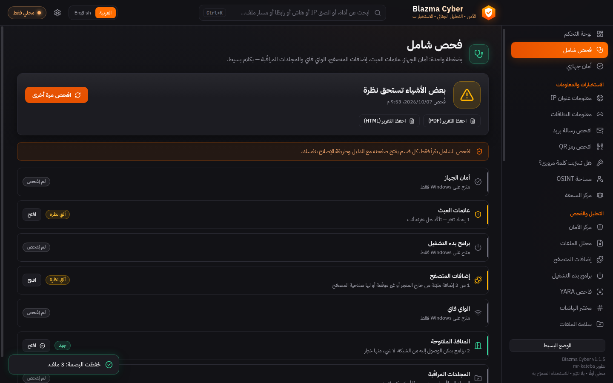 |
| 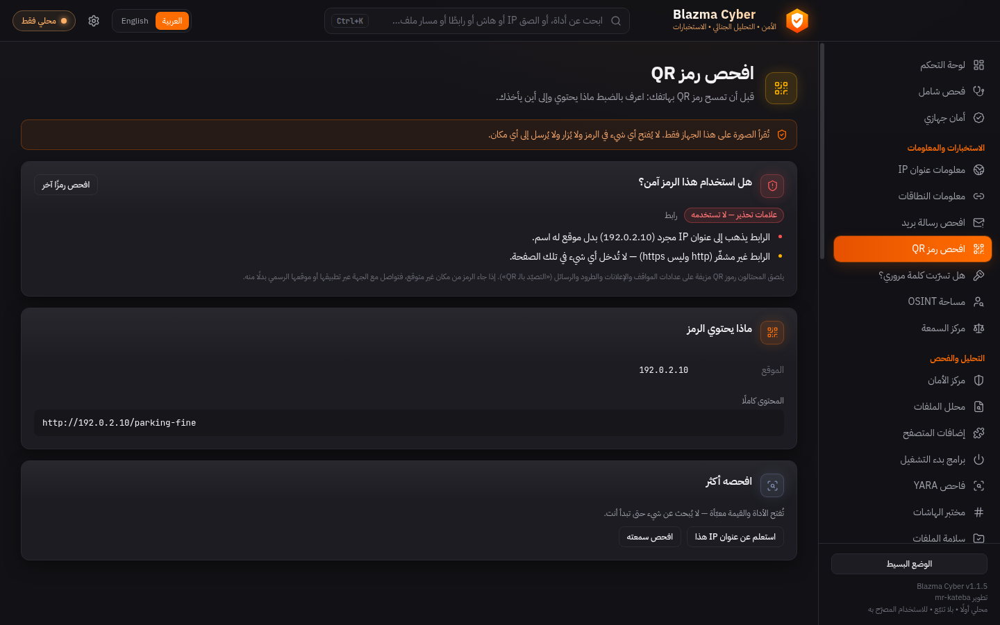 | 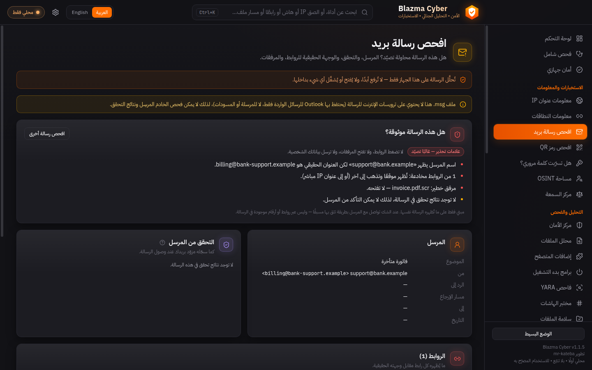 |
| 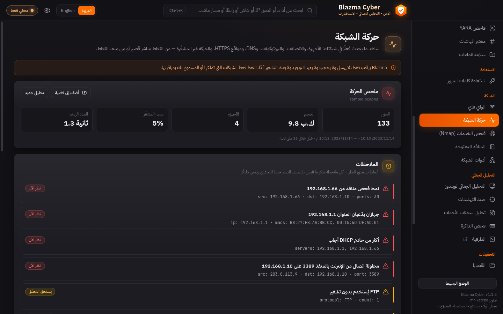 | 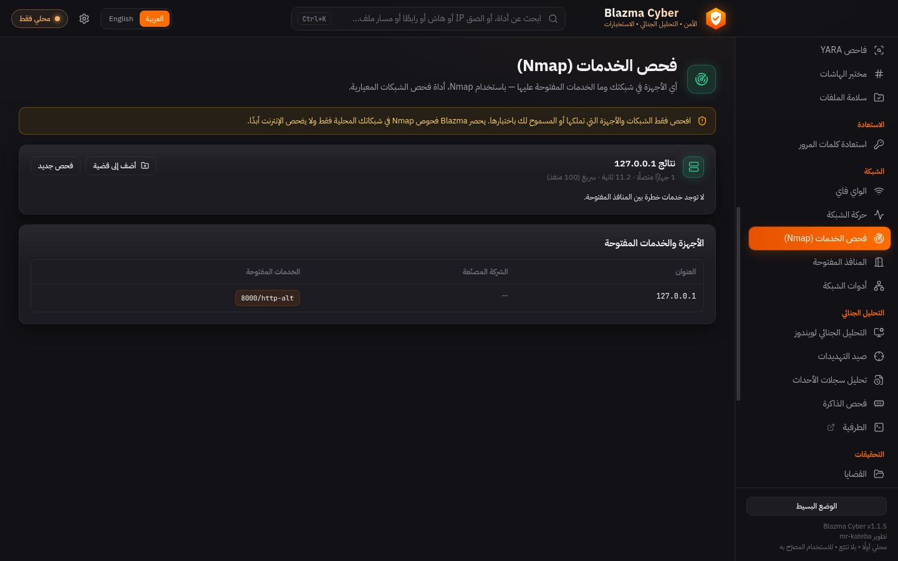 |
| 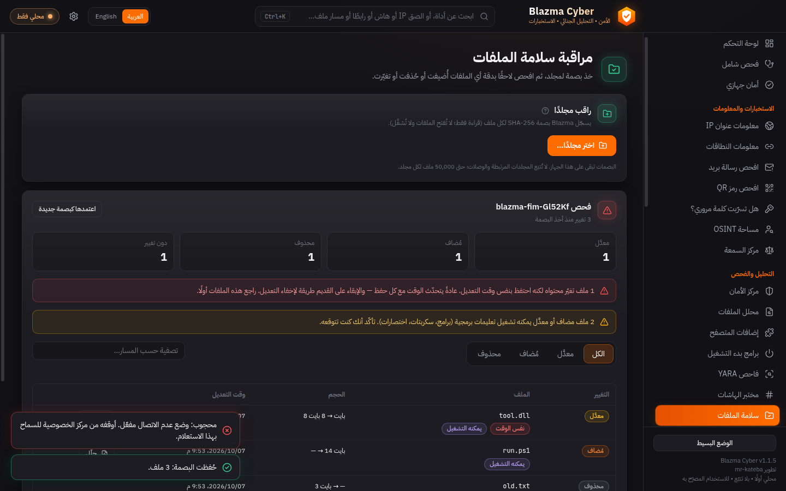 | 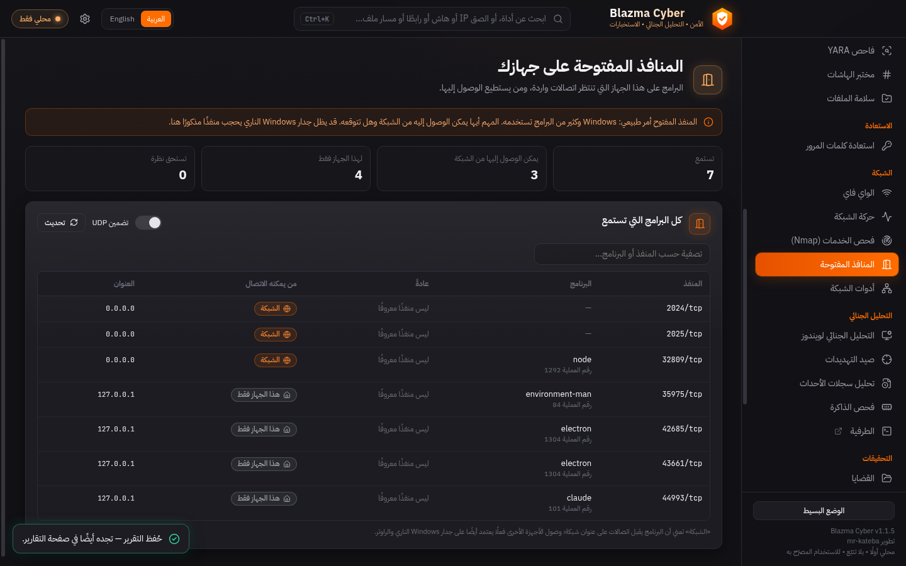 |
| 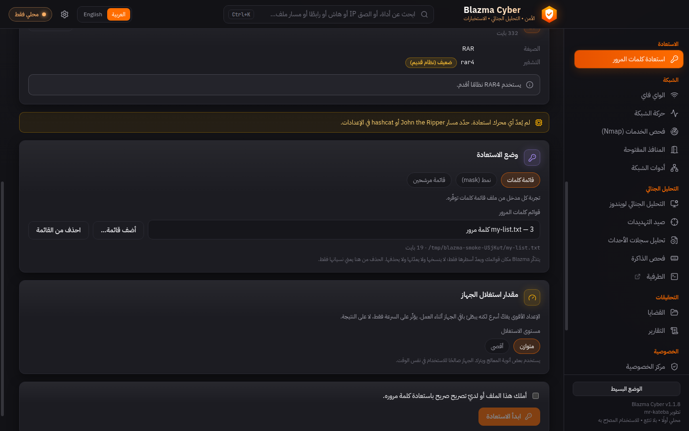 | 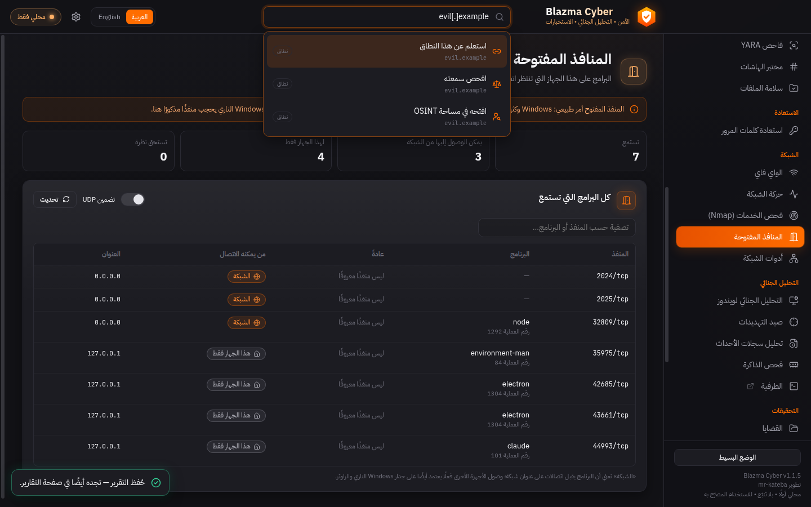 |
| 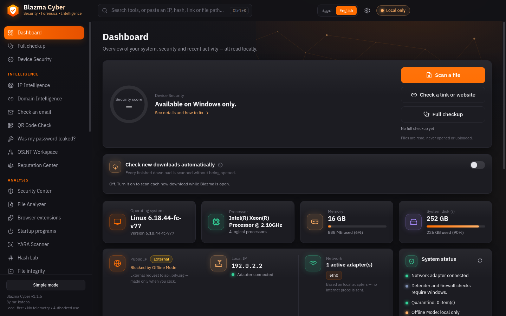 | 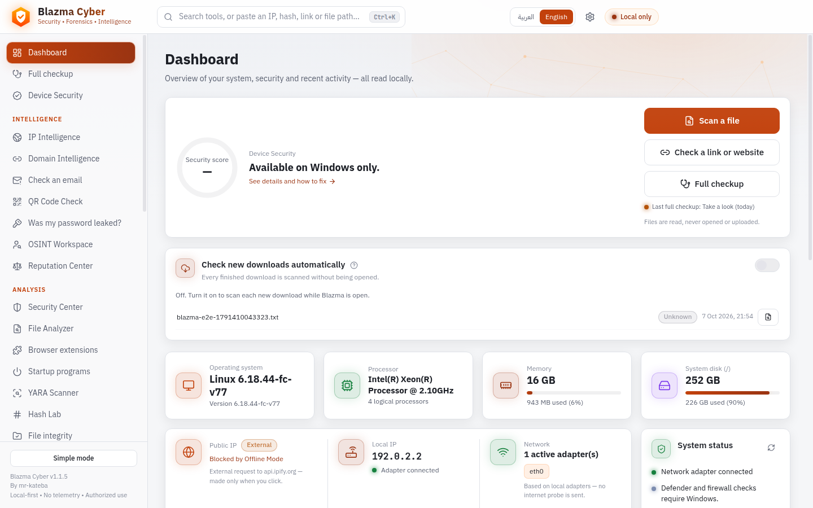 |

---

## Install

### Option A — the installer (easiest)
1. Open **[Releases](https://github.com/mr-kateba/Blazma-Cyber/releases/latest)** and download
   `Blazma-Cyber-<version>-x64-setup.exe` from **Assets**.
2. It is **unsigned** (a code-signing certificate is paid), so SmartScreen shows *"Windows protected
   your PC"* → **More info → Run anyway**.
3. Per-user install — **no administrator rights**. Creates Desktop and Start-menu shortcuts.

**No install?** Download `Blazma-Cyber-<version>-x64-portable.zip`, unzip anywhere (a USB stick is
fine) and run `Blazma Cyber.exe`. All data stays in a `Blazma-data` folder next to it.

**Verify the file:**
- `Get-FileHash .\Blazma-Cyber-<version>-x64-setup.exe -Algorithm SHA256` → compare with `SHA256SUMS.txt`.
- `gh attestation verify .\Blazma-Cyber-<version>-x64-setup.exe -R mr-kateba/Blazma-Cyber`
  (GitHub build-provenance attestation; needs the [GitHub CLI](https://cli.github.com)).

### Option B — from source
See [Build from source](#build-from-source). Full Arabic walkthrough: **[README.ar.md](README.ar.md)**.

---

## Build from source
Requirements: Windows 10/11 x64 and [Node.js 20+](https://nodejs.org) (22 LTS recommended).

```powershell
git clone https://github.com/mr-kateba/Blazma-Cyber.git Blazma-Cyber
cd Blazma-Cyber
.\Start-Blazma.ps1 -Install     # first time: installs locked dependencies, builds, launches
.\Start-Blazma.ps1              # afterwards
```

The launcher checks prerequisites and prints clear errors (English + Arabic) and never installs
anything unless you pass `-Install`. Build the installer with `npm ci && npm run dist:win`
(run it **on Windows**). Developer notes: [docs/DEVELOPMENT.md](docs/DEVELOPMENT.md) · [CLAUDE.md](CLAUDE.md).

```bash
npm ci
npm run dev      # hot-reload development
npm run check    # typecheck + unit tests + locale parity
```

---

## Engines
Blazma **bundles** these in the Windows installer (fetched from their official releases at build
time and pinned by SHA-256 — the app itself never downloads anything):

- **YARA-X** + **1,240 ReversingLabs rules** — malware-family detection.
- **capa** (Mandiant) — "what can this program do?" with MITRE ATT&CK ids.
- **Detect It Easy** — how a file was built, and whether it is packed.
- **Hayabusa** (4,000+ Sigma rules) — Windows event-log hunting.
- **HollowsHunter** — in-memory implant scan.

Optional, **user-installed** (Blazma never downloads or runs them by itself):

| Engine | Use | Setup |
|---|---|---|
| Microsoft Defender | File & folder scans | Ships with Windows — nothing to set up |
| Nmap ([nmap.org](https://nmap.org)) | Service scan of your own network | Install, then open the Service scan page — auto-detected |
| Wireshark + Npcap | Unelevated network capture; open captures in Wireshark | Install — without it, built-in Windows pktmon is used |
| John the Ripper ([openwall](https://www.openwall.com/john/)) / hashcat ([hashcat.net](https://hashcat.net/hashcat/)) | Authorized password recovery of your own files | Settings → Engines → pick the executable |
| VirusTotal / AbuseIPDB / Shodan / abuse.ch keys | Reputation lookups | Settings → API keys (stored DPAPI-encrypted) |

---

## Privacy & security
- **No telemetry, no account, no automatic uploads.** Offline Mode blocks every external request
  before a connection opens; each attempt is visible in Network Activity (host + data category only).
- **The renderer is sandboxed** (contextIsolation, strict CSP, `connect-src 'self'`); every IPC
  argument is re-validated in the main process; no shell strings; PowerShell runs fixed scripts with
  arguments passed via environment variables.
- **Secrets** are stored with Windows DPAPI (`safeStorage`) and logs auto-redact keys/tokens/passwords.
- **Analyzed files are never executed;** Blazma never disables Defender or changes the firewall.
- Details: [PRIVACY.md](PRIVACY.md) · [SECURITY.md](SECURITY.md) · [docs/ARCHITECTURE.md](docs/ARCHITECTURE.md).

---

## Project status
**v1.1.6 (stable).** Verified automatically on real Windows (Server 2025, the Windows 11 24H2 code
base) in CI: PowerShell facts, Defender status & EICAR file scan, Authenticode, forensics, the
network tools, a real pktmon capture, the Wi-Fi reader, startup/signature review, the full UI
end-to-end, and the NSIS installer build.

**Not yet hand-tested:** Wi-Fi on real Wi-Fi hardware, Nmap on Windows, install/uninstall on a
Windows 10/11 desktop, Defender quick/full scans, and real John/hashcat runs. Details:
[docs/ROADMAP.md](docs/ROADMAP.md).

---

## Troubleshooting
| Problem | Solution |
|---|---|
| "Windows protected your PC" / browser warns about the file | The installer is unsigned → **More info → Run anyway** / keep the file |
| The app icon looks generic | Windows caches icons — run `ie4uinit.exe -show` or restart; re-pin any old taskbar shortcut |
| "Node.js was not found" | Install Node.js 20+ and reopen PowerShell (source build only) |
| Script execution is disabled | `powershell -ExecutionPolicy RemoteSigned -File .\Start-Blazma.ps1` or `Unblock-File .\Start-Blazma.ps1` |
| "Blocked by Offline Mode" | Expected — turn Offline Mode off in the Privacy Center for online lookups |
| Defender shows "status unavailable" | Another antivirus may manage protection, or Defender is disabled by policy |

---

## Authorized use
Intended for **defensive** use on systems, networks and files you own or are authorized to assess.

## License
Copyright © 2026 [mr-kateba](https://github.com/mr-kateba).

Blazma Cyber is free software under the **GNU General Public License v3.0 or later**
([LICENSE](LICENSE)), distributed **WITHOUT ANY WARRANTY**. Anyone who distributes a modified
version must publish its source under the same license. Third-party components keep their own
licenses: [THIRD-PARTY-NOTICES.md](THIRD-PARTY-NOTICES.md).
